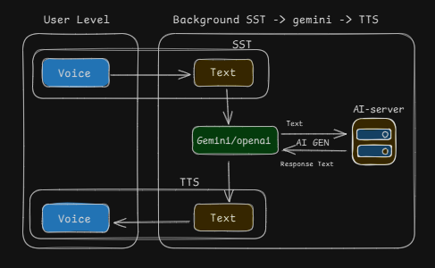

# SST to TTS with Web API and Gemini

Convert speech to text, generate a reply with Gemini, and play it back as speech—all via a web API.
 

## Steps

1. **Speak:**  
   Talk into your microphone.

2. **Transcribe:**  
   Speech is converted to text.

3. **Reply:**  
   Text is sent to Gemini API for a response.

4. **Playback:**  
   The reply is spoken aloud.

## Tech Used

- `SpeechRecognition` (for SST)
- `SpeechSynthesisUtterance` (for TTS)
- Gemini API (for replies)
